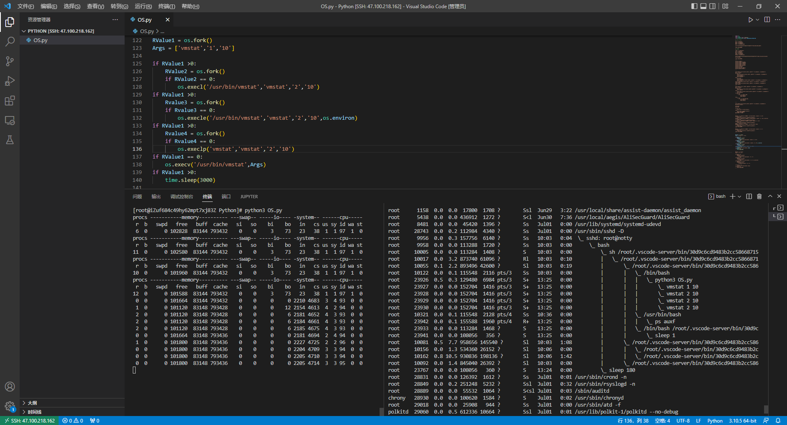

# 标准库

## 前述

1、参考来源：《Python语言参考手册》Python标准库

2、Python版本：3.10.5

3、Python手册版本：3.10.5

4、Python手册参考地址：

https://docs.python.org/zh-cn/3.10/library/

5、本篇内容只解析Linux下适用的函数。

6、本篇内容主要解析并演示本人认为重要性偏高及使用率较高的。

## 标准库

## 通用操作系统服务

#### os

##### 进程参数

1、进程及进程间关系

【1】os.getpid() ： Return the current process id.

【2】os.getppid() ： Return the parent’s process id. 

【3】os.getpgrp() ： Return the id of the current process group.

【4】os.getpgid(pid) ： Return the process group id of the process with process id pid. 

2、进程属主属组

【1】os.getlogin() ： Return the name of the user logged in on the controlling terminal of the process.

【2】os.getuid() ： Return the current process’s real user id.

【3】os.getgid() ：Return the real group id of the current process.

【4】os.geteuid() ： Return the current process’s effective user id.

【5】os.getegid() ： Return the effective group id of the current process. 

【6】os.getgroups() ： Return list of supplemental group ids associated with the current process.

3、进程环境信息

【1】os.environ ：A mapping object where keys and values are strings that represent the process environment.

【2】os.uname() ： Returns information identifying the current operating system. 

【3】os.ctermid() ： Return the filename corresponding to the controlling terminal of the process.

【4】os.getenv(key, default=None) ： Return the value of the environment variable key if it exists, or default if it doesn’t.  key, default and the result are str. 

##### 进程管理

###### 进程创建

1、os.fork() : Fork a child process. Return 0 in the child and the child’s process id in the parent. 

2、spawn* ：Execute the program *path* in a new process.

【1】函数列表

- os.spawnl(mode, path, ...)
- os.spawnle(mode, path, ..., env)
- os.spawnlp(mode, file, ...)
- os.spawnlpe(mode, file, ..., env)
- os.spawnv(mode, path, args)
- os.spawnve(mode, path, args, env)
- os.spawnvp(mode, file, args)
- os.spawnvpe(mode, file, args, env)

【2】名称后缀解释

- spawn* 函数的 "l" 和 "v" 变体不同在于命令行参数的传递方式。
- 结尾包含第二个 "p" 的变体将使用 PATH 环境变量来查找程序 file。
- 对于以e结尾的函数，env 参数是一个映射，用于定义新进程的环境变量（代替当前进程的环境变量）。

【3】mode 参数的可取值

- os.P_NOWAIT
- os.P_NOWAITO
- os.P_WAIT

3、exec* ： These functions all execute a new program, replacing the current process;

【1】函数列表

- os.execl(path, arg0, arg1, ...)
- os.execle(path, arg0, arg1, ..., env)
- os.execlp(file, arg0, arg1, ...)
- os.execlpe(file, arg0, arg1, ..., env)
- os.execv(path, args)
- os.execve(path, args, env)
- os.execvp(file, args)
- os.execvpe(file, args, env)

###### 进程回收

1、os.wait() ： Wait for completion of a child process, and return a tuple containing its pid and exit status indication

2、os.waitpid(pid, options)  ： Wait for completion of a child process given by process id *pid*, and return a tuple containing its process id and exit status indication 

3、os.wait3(options) ： Similar to waitpid(), except no process id argument is given and a 3-element tuple containing the child’s process id, exit status indication, and resource usage information is returned. 

4、os.wait4(pid, options) ： Similar to waitpid(), except a 3-element tuple, containing the child’s process id, exit status indication, and resource usage information is returned. 

###### 进程退出

1、os._exit(n) ： Exit the process with status *n*, without calling cleanup handlers, flushing stdio buffers, etc.

注：sys.exit(n)讲Python运行时服务时再讲解

###### 进程信号

1、os.abort() ： Generate a SIGABRT signal to the current process. 

2、os.kill(pid, sig) ： Send signal sig to the process pid. 

3、os.killpg(pgid, sig) ： Send the signal sig to the process group pgid.

###### 进程优先级

1、os.nice(increment)

##### 调度器接口

##### 文件名，命令行参数，以及环境变量

##### 文件和目录

#####  文件描述符操作

##### 其他系统信息

#### io

#### time

#### platform

#### argparse

#### loging

