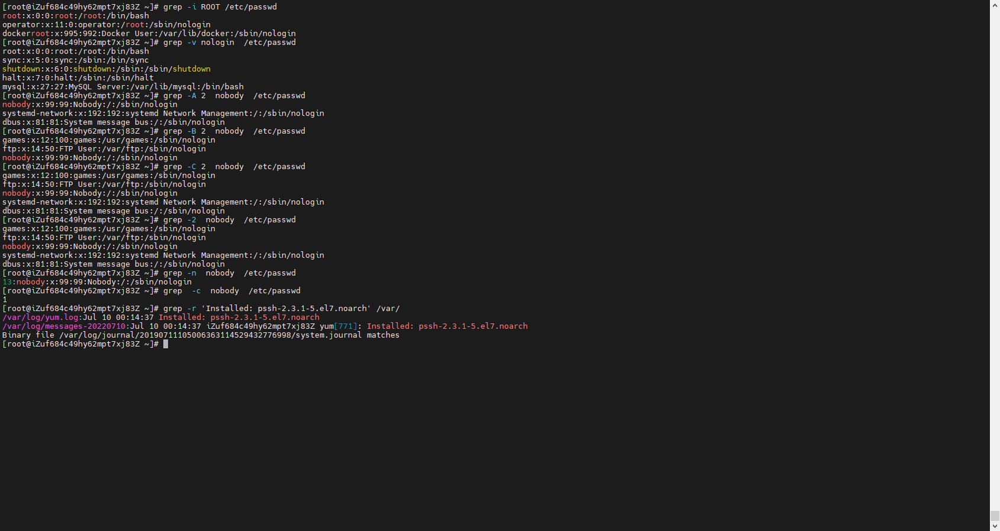

# 基础工具

## 前述

1、本篇会对文件管理中功能性、综合性、使用率更强更高的工具进行讲解。

2、本篇内容仅限于清晰明确理解格式及语法，命令选项满足于一般的工作需要。对工具的功能性全面了解还请阅读官方手册或者man日志。

3、本文不对涉及到的正则表达式进行讲解，有时间单独开篇。

## 正篇

##### Grep

###### 概述

1、简述：prints lines that contain a match for one or more patterns.

2、官方地址：[][]https://www.gnu.org/software/grep/manual/grep.html

3、基本格式：grep [option...] [patterns] [file...]

###### 选项

1、-i ：  Ignore case distinctions in both the PATTERN and the input files.（不区分大小写）

2、-v ：Invert the sense of matching, to select non-matching lines.（反选）

3、-A NUM ： Print NUM lines of trailing context after matching lines.（输出指定行及指定行之后的NUM行）

4、-B NUM ： Print NUM lines of leading context before matching lines. （输出指定行及指定行之前的NUM行）

5、-C NUM, -NUM ： Print  NUM  lines  of  output context. （输出指定行及指定行前后各NUM行）

6、-r ： Read all files under each directory, recursively, following symbolic links only if they are on the command line. （递归读取目录下每个文件） 

7、-R ：Read all files under each directory, recursively.  Follow all symbolic links, unlike -r.（递归读取目录下每个文件，-r于-R区别请读左侧）

8、-n ： Prefix each line of output with the 1-based line number within its input file. （显示行号）

9、-c ： Suppress normal output; instead print a count of matching lines for each input file.（输出匹配到的行数）

##### Sed

###### 概述

1、简述：Sed is a stream editor. 

2、官方手册：[][]https://www.gnu.org/software/sed/manual/sed.html

3、基本格式：sed OPTIONS... [SCRIPT] [INPUTFILE...]

###### 选项

###### script

1、Syntax

2、Address

3、Commands

##### Gawk（awk）

###### 概述

###### options

###### program-text

1、Syntax

【1】[pattern]  { action }

【2】pattern  [{ action }]

【3】function name(args) { … }

2、Patterns

3、Actions

4、Expressions

5、Functions

6、Arrays

