# 进程查看

# 1、进程查看

1、ps：report a snapshot of the current processes.

1.6、示例

1.6.01、ps -e

1.6.02、ps -ef

1.6.03、ps  -eF

1.6.04、ps -elf

1.6.05、ps -eLf

1.6.06、ps -ejH

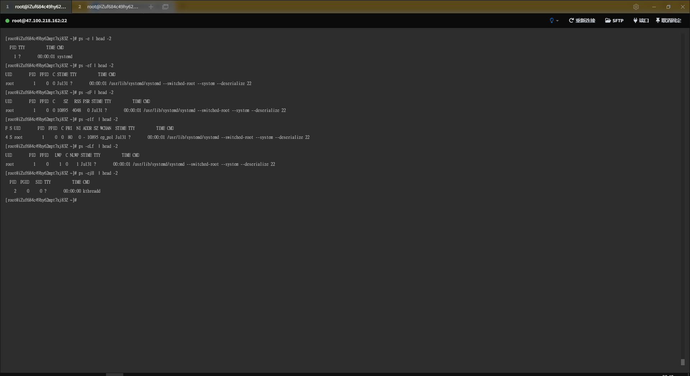

1.6.07、ps ax

1.6.08、ps axu

1.6.09、ps axuf

1.6.10、ps  axjf

1.6.11、ps axms

1.6.12、 ps axo pid,cmd,%cpu,%mem --sort -%mem

1.6.13、ps axo stat,euid,ruid,tty,tpgid,sess,pgrp,ppid,pid,pcpu,comm

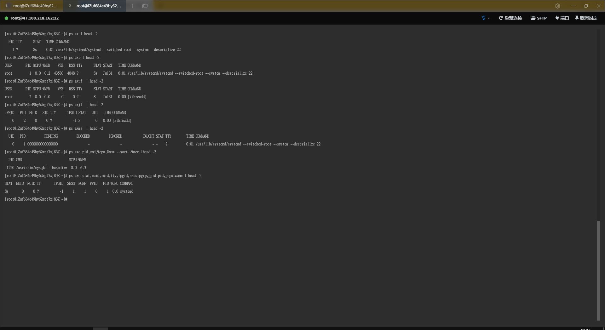

1.6.14、 ps -Lfp 1

1.6.15、ps  -O  cgroup

1.6.16、ps -eO cgroup

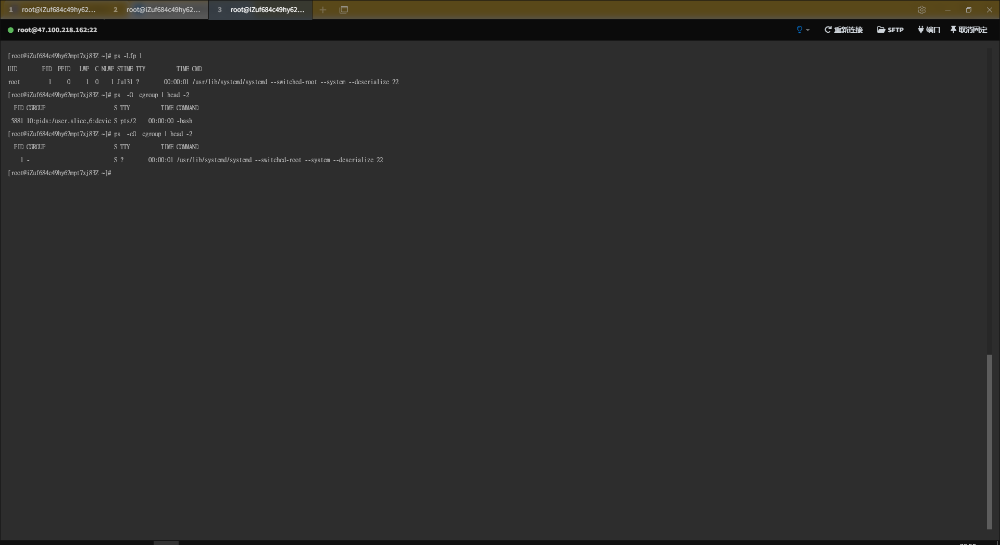

1.6.17、ps -o cgroup

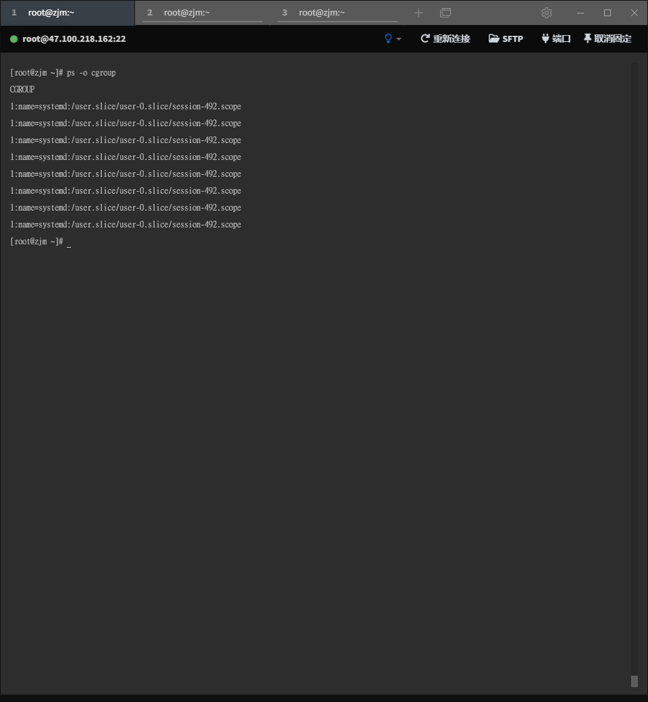

1.6.18、ps -eo  pid,pidns

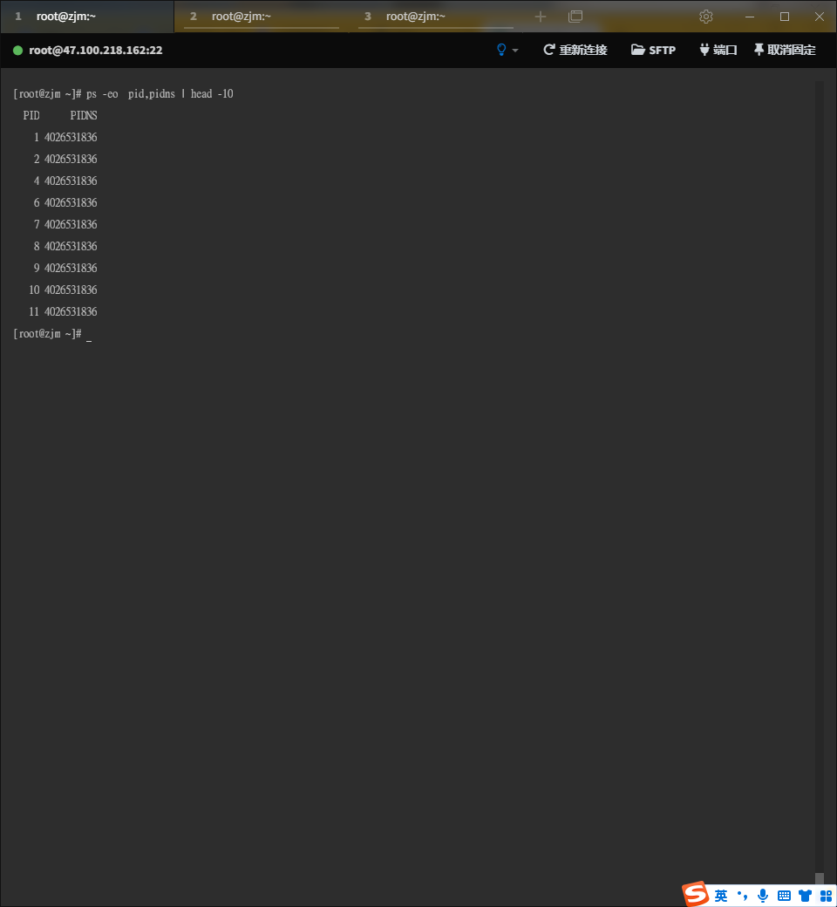

2、pidof： find the process ID of a running program.

2.6、示例

2.6.1、pidof systemd

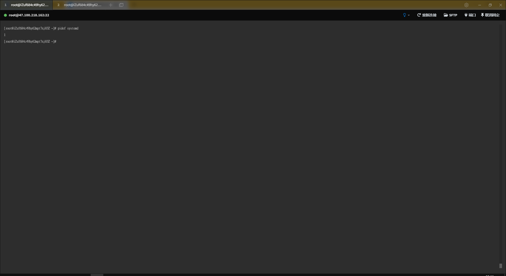

3、pwdx：report current working directory of a process

3.6、示例

3.6.1、pwdx 1

4、pgrep：look up or signal processes based on name and other attributes

4.6、示例

4.6.1、pgrep  mysql

4.6.2、pgrep -l  mysql

4.6.3、pgrep -a  mysql

4.6.4、pgrep -n  mysql

4.6.5、pgrep -o  mysql

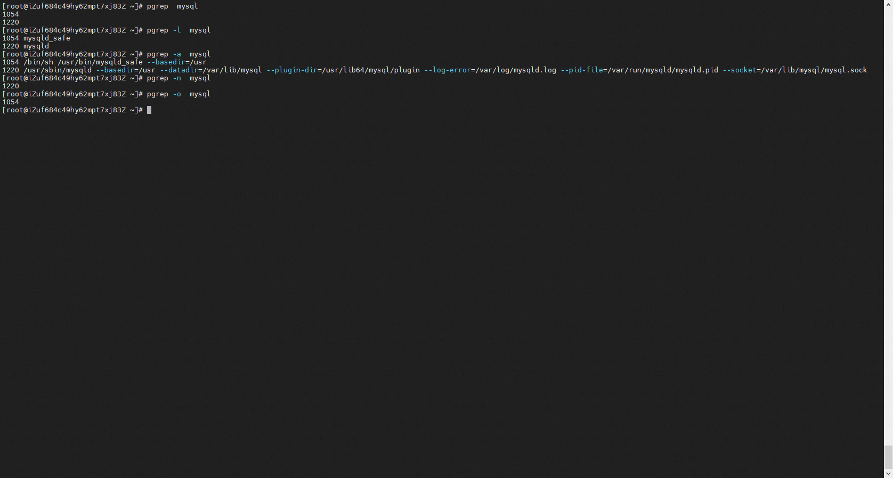

4.6.6、pgrep -l -a  --ns 4814

4.6.7、pgrep -l -a  --ns 4814 --nslist net

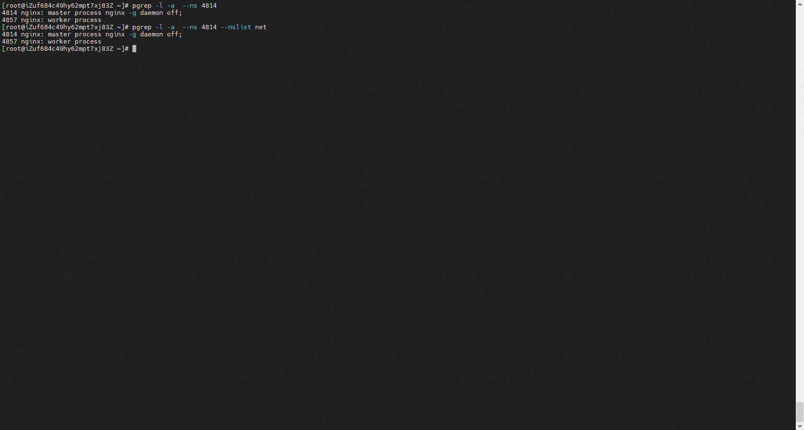

5、pstree：display a tree of processes

5.2、

pstree [-a, --arguments] [-c, --compact] [-h, --highlight-all, -Hpid, --highlight-pid pid] [-g] --show-pgids] [-l, --long] [-n, --numeric-sort] [-N, --ns-sortns [-p, --show-pids] [-s, --show-parents] [-S, --ns-changes] [-u, --uid-changes] [-Z, --security-context] [-A, --ascii, -G, --vt100, -U, --unicode] [pid, user]

5.5、参数

5.5.1、-a：Show command line arguments. 

5.5.2、-g：Show PGIDs.

5.5.3、-n：Sort processes with the same ancestor by PID instead of by name.

5.5.4、-p：Show PIDs.

5.5.5、-s：Show parent processes of the specified process.

5.5.6、-S：Show namespaces transitions.

5.6、示例

5.6.1、pstree

5.6.2、pstree 1054

5.6.3、pstree -s 1054

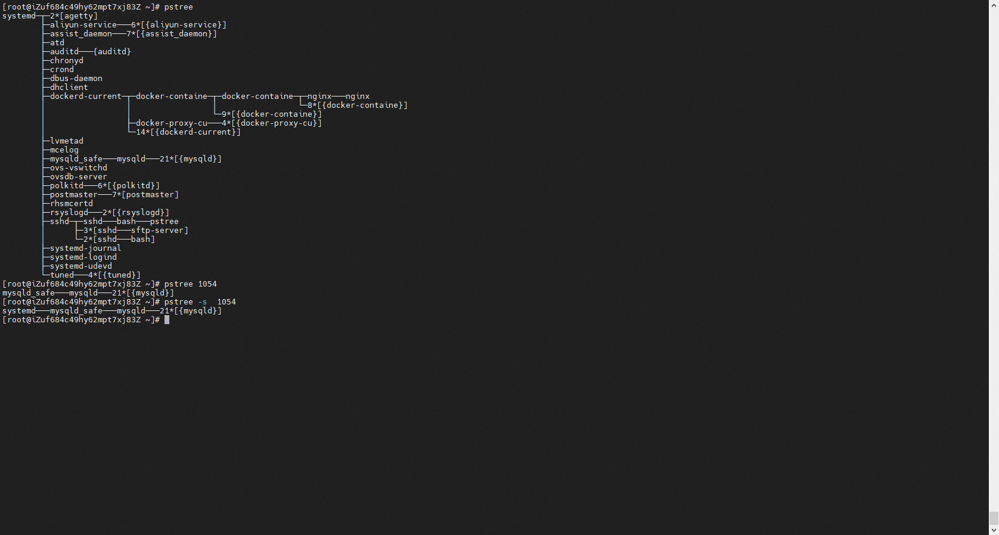

5.6.4、pstree root

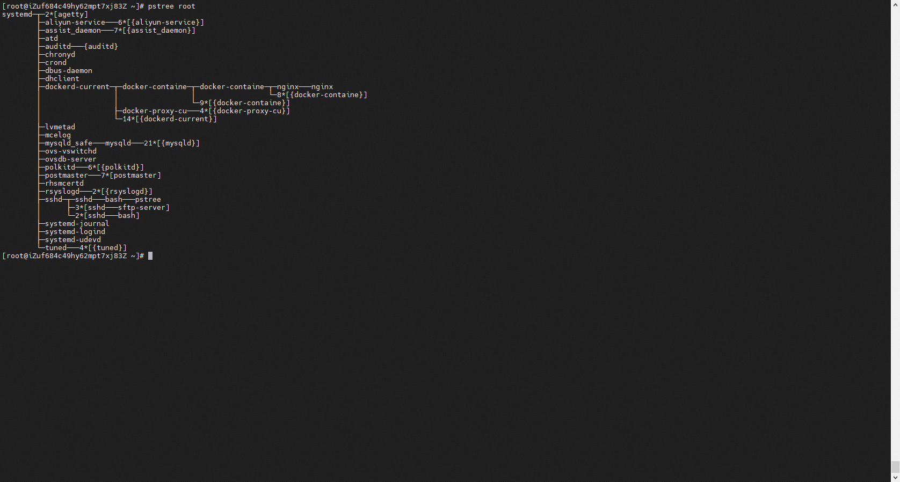

5.6.5、pstree -p  -n -a

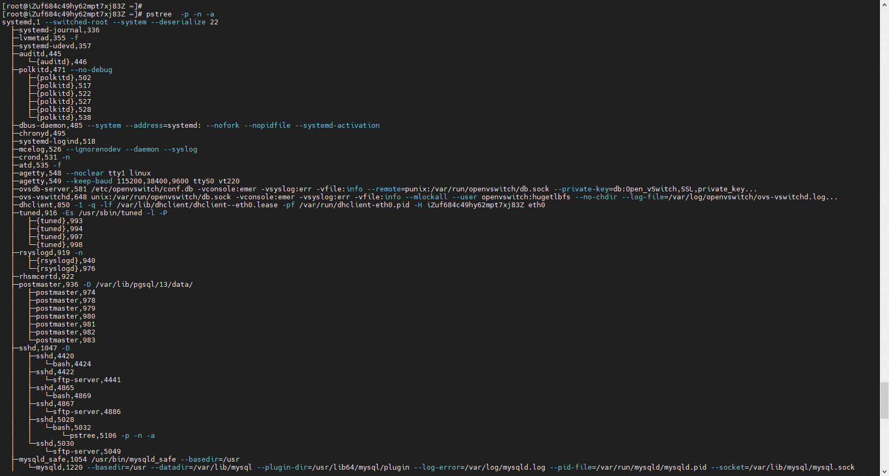

观点：如果是进程，那么名字是没有大括号的，如果是线程，那么名字是带大括号的。

5.6.6、pstree -p -n -a -S -g

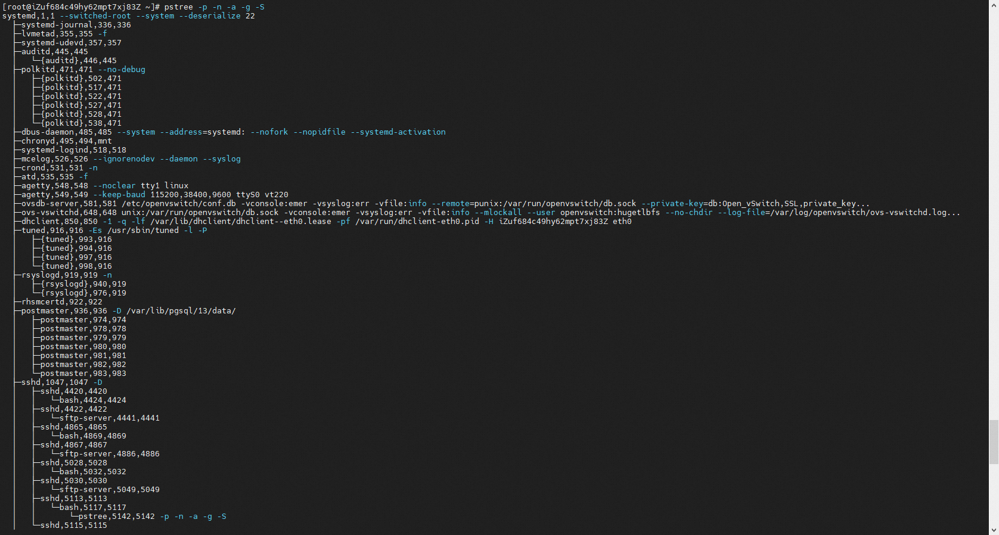

6、prtstat：print statistics of a process

6.6、示例

6.6.1、prtstat 1

6.6.2、prtstat -r 1

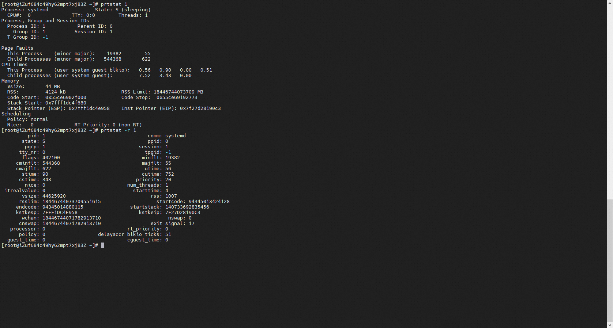
