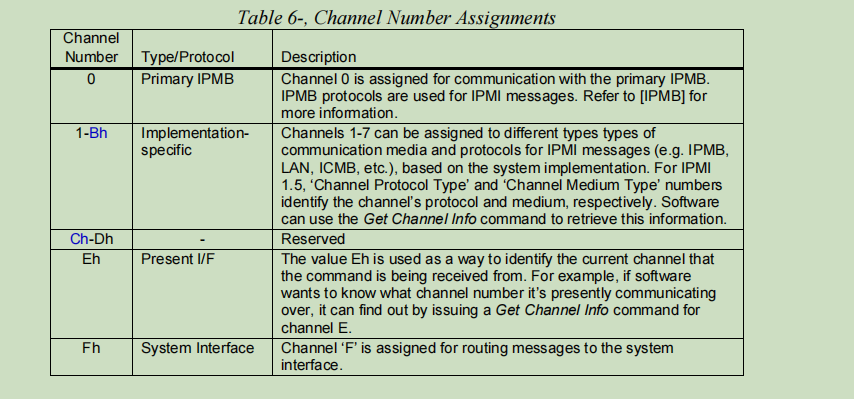
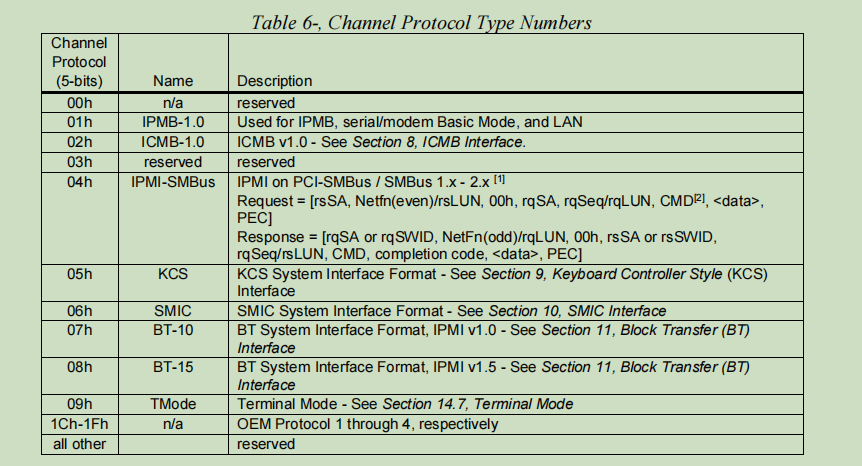
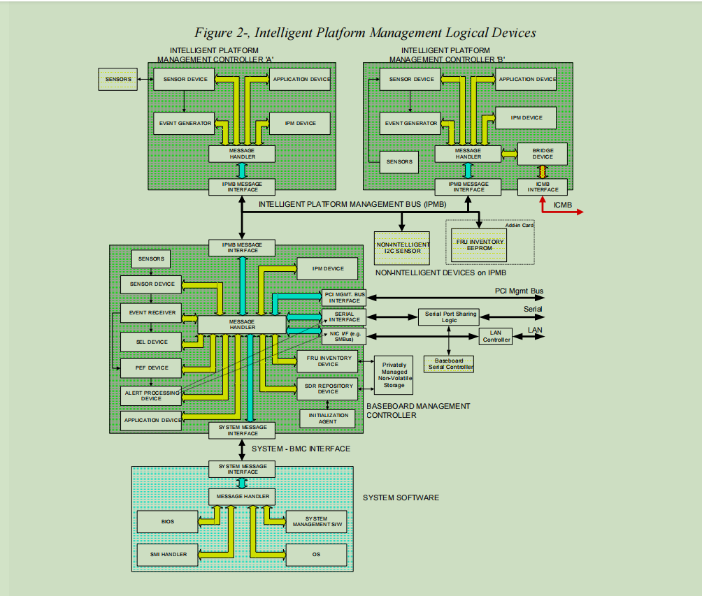
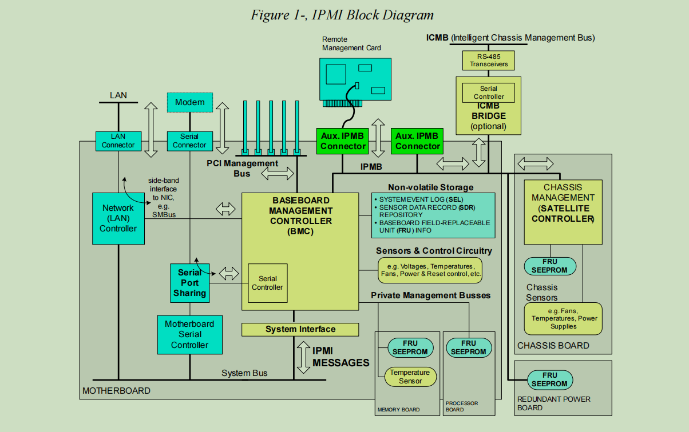

# 次序管理

## 平台

###### IPMI

一、概述

1、IPMI简述：

（1）IPMI定义：

【1】IPMI全称： Intelligent Platform Management Interface (IPMI)

【2】IPMI规范：IPMI为平台管理子系统定义了标准的、抽象的接口。IPMI接口定义包括拓展平台管理系统的多个机箱之间以及同一机箱内板卡之间的接口定义。

​          The IPMI specifications define standardized, abstracted interfaces to the platform management subsystem. IPMI includes the definition of interfaces for extending platform management between board within the main chassis, and between multiple chassis.

【3】平台管理：术语平台管理指的是硬件内置的监控及控制功能。主要目的是监控硬件系统的健康状况。

​         The term “platform management” is used to refer to the monitoring and control functions that are built in to the platform hardware and primarily used for the purpose of monitoring the health of the system hardware. 

（2）规范内容：

【1】总体架构

【2】通用命令

【3】事件格式

【4】数据记录

【5】功能

​         It defines the overall architecture, common commands, event formats, data records, and capabilities used across IPMI-based systems and peripheral chassis. 

（3）IPMI特性：运行在服务器内无代理的独立子系统

​         换句话说：只要BMC以及IPMI的固件支持，就可以独立运作

（4）IPMI功能：从使用的角度来说，将IPMI的功能按如下形式整理：

【1】信息查询：

- 基本信息：厂商信息等
- 日志记录
- 健康状况：温度、风扇转速等

【2】机器管理：开机、关机、装机等。

【3】其他功能：Remote Console等。

（5）IPMI设置：

【1】BIOS设置：BIOS--->IPMI--->IPMI设置选项，可以管理网络、事件记录等

【2】工具设置：通过ipmicfg、ipmitool、ipmiutil等进行设置。

（6）其他介绍：

【1】IPMI版本：

- IPMI1.0：基本规范

- ipmi1.5：允许IPMI系统通过串口，BMC专用的带外网口，或者与主机共享的带内网口（NC-SI）与远程管理系统通讯

- ipmi2.0：增加了SQL（serial over LAN）等功能

【2】替代协议：RedFish

- IPMI也在2015年公布2.0 v1.1标准后，Intel也宣布不再维护，不再更新

- ipmi被RedFish永久代替

【3】其他介绍：暂略

2、IPMI实现：

（1）厂商实现：因为IPMI只是一套协议规范，所以厂商可以在规范下有自己的实现。

（2）基本组成：基本可以概括为BMC+其他固件，例如SMC（satellite management controller，外围组织管理控制器）

【1】BMC：基板管理控制器(Baseboard Management Controller），是IPMI的核心。

- BMC通常是一个贴片或者外挂在服务器主板上的独立的板卡。

- 在该系统中有ipmi的守护进程来处理主机或者远程管理的命令。

- 工作并不依赖于服务器的处理器、BIOS或操作系统，而是有常电供电并独立运行的，具有一个单独的子系统。

【2】IPMI与BMC：个人观点

- IPMI是一个接口规范，BMC是一个实现上的物理器件。
- 但是我们在使用IPMI工具获取相应的信息时，最终的信息都是BMC返回给我们的（工作原理时讲解），这也是BMC的核心之处。

（3）其他相关：

【1】传感器：关于硬件的信息（譬如温度等）第一个获取者是传感器，传感器获取到才能传递给BMC。

【2】FRU：现场可更换单元，如电源供应器、风扇。FRU的信息也被称为VPD或FRU data，这些信息包括厂商、产品信息。这些信息一般都会进行烧录。

【3】其他器件：暂略

3、工作原理：

（1）通信接口：

【1】可远程的接口： ICMB、LAN、Serial/Modem

The ICMB, LAN, and Serial/Modem interfaces are typically used to communicate with management software on another system. 

【2】 System Interface： SMIC、KCS、BT、SSIF

Local software running on the managed system and using the System Interface to the BMC will generally be referred to as *system management software* or *SMS.* 

【3】其他接口类型：

- IPMB MESSAGE  INTERFACE
- PCI MGMT BUS INTERFACE

（2）通道模型：IPMI uses a ‘channel model’ for directing communication between different interfaces in the BMC. 

【1】Channel Numbers：

​		Each interface has a *channel number* that is used when configuring the channel and for routing messages between channels. 

【2】Channel Protocol Type：

​		The protocol used for transferring IPMI messages on a given channel is identified using a channel protocol type number（5-bits）. 

【3】Channel Medium Type：

​		The Channel Medium Type number is a seven-bit value that identifies the general class of medium that is being used for the channel. 

（3）传输流程：

二、系统

1、启动查看：

【1】dmesg | grep ipmi

注释：物理机上可以正常的使用IPMI的工具，但是虚拟机上不行。虚拟机启动会报：Unable to find any System Interface(s)

个人 观点：因为IPMI是属于外围设备，以KVM为例，KVM会进行计算虚拟化，KVM-qemu会虚拟化I/O、存储、网络，但是并不会虚拟化外围设备呀。

2、内核模块：只有加载了相关内核模块才能正常使用应用层级的工具。

（1）相关模块：ipmi_watchdog、ipmi_poweroff、ipmi_devintf

（2）模块查看：lsmod | grep ^ipmi

（3）模块加载：modprobe  模块名称

3、设备文件：/dev/ipmi0 or /dev/ipmi/0 or /dev/ipmidev/0:

三、工具：

1、ipmicfg：

2、ipmitool：

（1）概述：

【1】简述：utility for controlling IPMI-enabled devices

【2】格式：ipmitool [ < options> ] < command> [ < sub-commands and sub-options> ]

【3】描述： 这是一个通过内核驱动让你管理本地系统或远程系统的IPMI功能的程序，使用IPMI1.5或IPMI2.0版本。

​		This  program  lets  you manage Intelligent Platform Management Interface (IPMI) functions of either the local system, via a kernel device driver, or a remote system, using IPMI v1.5 and IPMI v2.0.

（2）OPTIONS：

【1】 -I < interface>： 选择使用的接口（Selects IPMI interface to use），默认使用open。

不同的接口，对应的是不同的内核驱动，以下介绍三种：

- open       Linux OpenIPMI Interface [default]

  ​                The  ipmitool open interface utilizes the OpenIPMI kernel device driver.

- lan           IPMI v1.5 LAN Interface（远程访问IPMI1.5版本可选），  

  ​                The ipmitool lan interface communicates with the BMC over an Ethernet LAN connection using UDP under IPv4. 

- lanplus   IPMI v2.0 RMCP+ LAN Interface（远程访问IPMI2.0版本可选）

  ​                Like  the  lan interface, the lanplus interface communicates with the BMC over an Ethernet LAN connection using UDP under IPv4.

【2】-H hostname： Remote host name for LAN interface

当我们的-I选择了lan或lanplus接口类型后，需要使用此选项指定远程的主机名，也可以使用IP地址。

【3】-p port： Remote RMCP port [default=623]

【4】-U username：Remote session username

【5】-P password： Remote session password

【6】-f file： Read remote session password from file

（3）Command：

【1】sel： Print System Event Log (SEL)

- info：This command will query the BMC for information about the System Event Log (SEL) and its contents.
- list | elist ：When  this  command is invoked without arguments, the entire contents of the System Event Log are displayed. 
- save < file >：Save SEL records to a text file that can be fed back into the event file ipmitool command.

【2】fru： Print built-in FRU and scan SDR for FRU locators

- print：Read all Field  Replaceable  Unit (FRU) inventory data and extract such information as serial number, part number, asset tags, and short strings describing the chassis, board, or product.

【3】 sdr：Print Sensor Data Repository entries and readings

- info： This command will query the BMC for Sensor Data Record (SDR) Repository information. 
- type [< sensor type >]：This  command  will  display  all records from the SDR Repository of a specific type. 
- list | elist [<all|full|compact|event|mcloc|fru|generic>] ： This command will read the Sensor Data Records (SDR) and extract sensor information of a given type,  then query each sensor and print its name, reading, and status.

【4】sensor： Print detailed sensor information

- list：Lists sensors and thresholds in a wide table format.

【5】power：Shortcut to chassis power commands

【6】mc： Management Controller status and global enables

- info：Displays information about the BMC hardware, including device revision, firmware revision, IPMI version supported, manufacturer ID, and information on additional device support. 

【7】lan： Configure LAN Channels

- print [< channel >]： Print the  current  configuration  for  the  given channel.  The default will print information on the first found LAN channel.

【8】user：Configure Management Controller users

【9】 sol： Configure and connect IPMIv2.0 Serial-over-LAN

- activate [usesolkeepalive | nokeepalive] [instance=]： Causes  ipmitool  to enter Serial Over LAN mode, and is only available when using the lanplus interface. 

3、ipmiutil：

4、FreeIPMI：

5、openipmi：

6、IPMIView：

