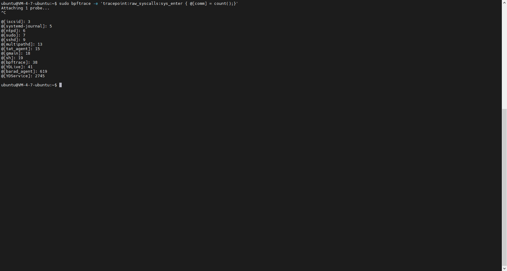

# bpftrace

## 前述

不断补全中~~~

## 语法

## 实例

###### 提示：

1、系统发行版本：Ubuntu 20.04 LTS

2、系统内核版本：5.4.0

3、bpftrace版本：0.9.4

###### 以下实例来源于：《BPF之巅<洞悉Linux系统和应用性能>》

sudo bpftrace -e 'tracepoint:raw_syscalls:sys_enter { @[comm] = count();}'  

根据进程名称分别统计时段内发生的系统调用次数。

sudo bpftrace -e 'tracepoint:raw_syscalls:sys_enter { @[pid, comm] = count(); }'

sudo bpftrace -e 'tracepoint:syscalls:sys_enter_execve{ join(args->argv);}'

sudo bpftrace -e 'tracepoint:syscalls:sys_enter_openat { printf("%s %s\n",comm,str(args->filename));}'

sudo bpftrace -e 'tracepoint:syscalls:sys_enter_execve {printf("%s ->%s\n",comm,str(args->filename));}'

sudo bpftrace -e 'tracepoint:syscalls:sys_enter_*{ @[probe] = count();}'

sudo bpftrace -e 'tracepoint:syscalls:sys_exit_read /args->ret/ { @[comm] = sum(args->ret);}'

sudo bpftrace -e 'tracepoint:syscalls:sys_exit_read { @[comm] = hist(args->ret);}'

sudo bpftrace -e 'tracepoint:block:block_rq_issue { printf("%d %s %d\n",pid,comm,args->bytes);}'

sudo bpftrace -e 'software:major-faults:1 { @[comm] = count();}'

sudo bpftrace  -e 'software:faults:1 { @[comm] = count();}'

sudo bpftrace -e 'profile:hz:49 /pid == 796655/ { @[ustack] = count();}'

