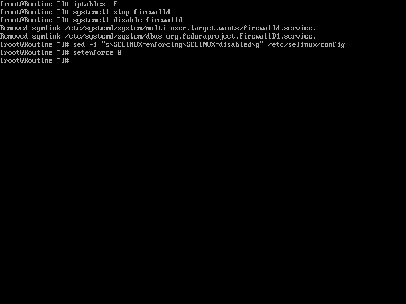
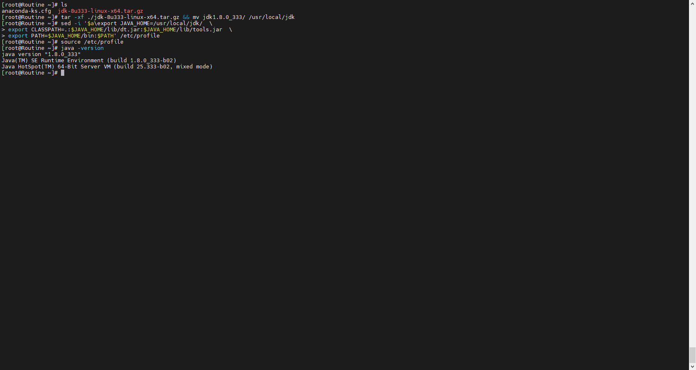
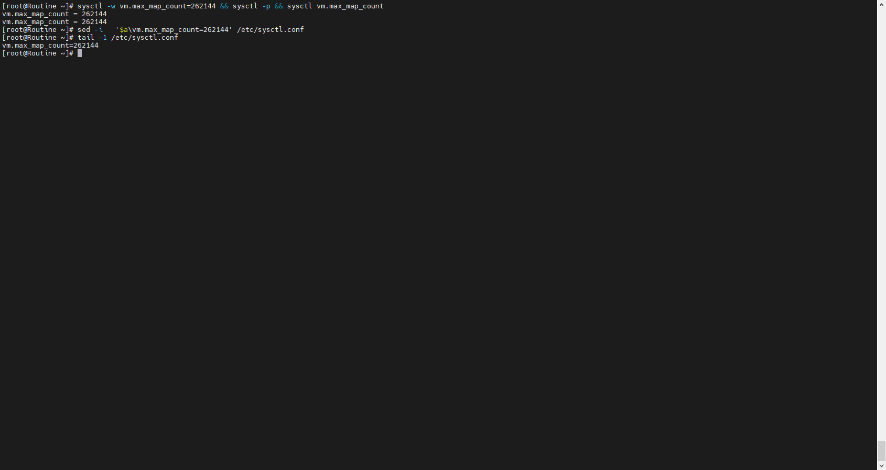
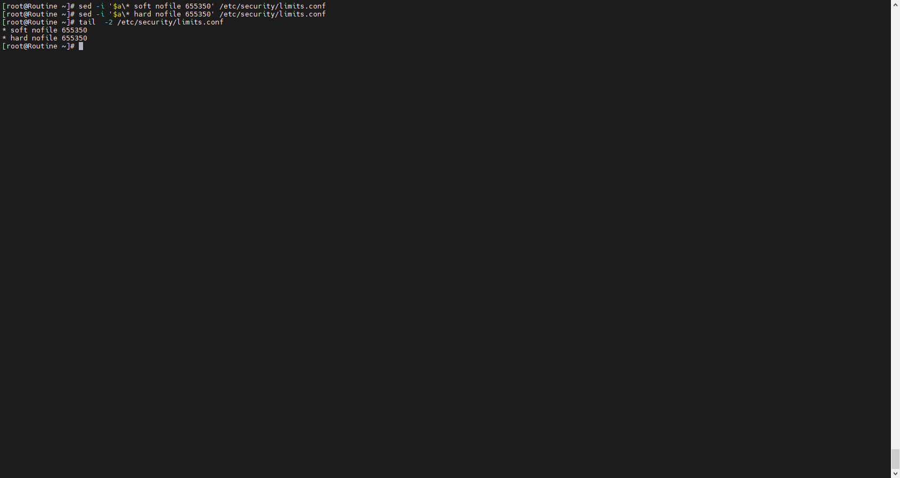

# ElasticStack

## 前述

###### ElasticStack官网：

[ ]()https://www.elastic.co/cn/

###### Elastic中文社区：

[ ]()https://elasticsearch.cn/

###### 本篇内容：

1、ElasticStack基本介绍

2、ElasticStack基本部署

3、ElasticStack基本使用


## 基本介绍

###### 什么是Elastic Stack？

Elastic Stack 由一系列产品组件构成，能够对数据进行采集、搜索、分析、可视化。

###### Elastic Stack与ElK Stack。

1、Elastic Stack 是 ELK Stack 的下一步演进。

2、ElK Stack 在2015年加入了一系列称之为beats的组件。 但是放弃了称之为BELK，而是称之为Elastic Stack。

3、The Elastic Stack is the ELK Stack, but with more flexibility to do great things.

###### Elastic Stack的基本组成与各自功能

1、Elasticsearch： Elasticsearch is a search and analytics engine.

2、Logstash：Logstash is a server‑side data processing pipeline.

3、Kibana：Kibana lets users visualize data with charts and graphs in Elasticsearch.

4、Beats：a family of lightweight, single-purpose data shippers.

【1】Filebeat : Log files and journals

【2】Auditbeat : Audit data

【3】Functionbeat : Cloud data 

【4】Heartbeat : Availability

【5】Metricbeat : Metrics

【6】Packetbeat : Network traffic

【7】Winlogbeat : Windows event logs


## 基本部署

###### 前述

1、Elastic Stack版本：8.2.2

2、OS发行版本 ：CentOS 7

3、机器环境：

【1】台数：三台

【2】配置：4G1核

【3】IP：192.168.1.133 192.168.1.134 192.168.1.135

###### ElasticSeach

1、ElasticSearch 安装前置步骤（此步骤三台均做且相同）

【1】进行安全配置

`iptables -F`

`systemctl stop firewalld`

`systemctl disable firewalld`

`sed -i "s\SELINUX=enforcing\SELINUX=disabled\g" /etc/selinux/config`

`setenforce 0`



【2】Jdk 安装 

`tar -xf ./jdk-8u333-linux-x64.tar.gz && mv jdk1.8.0_333/ /usr/local/jdk`

```
sed -i '$a\export JAVA_HOME=/usr/local/jdk/  \
export CLASSPATH=.:$JAVA_HOME/lib/dt.jar:$JAVA_HOME/lib/tools.jar  \
export PATH=$JAVA_HOME/bin:$PATH' /etc/profile
```

`source /etc/profile`

`java -version`



【3】修改内核参数

`sysctl -w vm.max_map_count=262144 && sysctl -p && sysctl vm.max_map_count`

`sed -i   '$a\vm.max_map_count=262144' /etc/sysctl.conf`

因为会重启启动，所以可以不执行第一条临时修改方案，只进行第二条，第二条重启后才会生效。



【4】创建用户

`useradd es`

`passwd es`


【5】修改用户限制

`sed -i '$a\* soft nofile 655350' /etc/security/limits.conf`

`sed -i '$a\* hard nofile 655350' /etc/security/limits.conf`



【6】进行重新启动

`reboot`

2、ElsatciSearch 进行安装配置

3、ElasticSearch  前端工具安装
