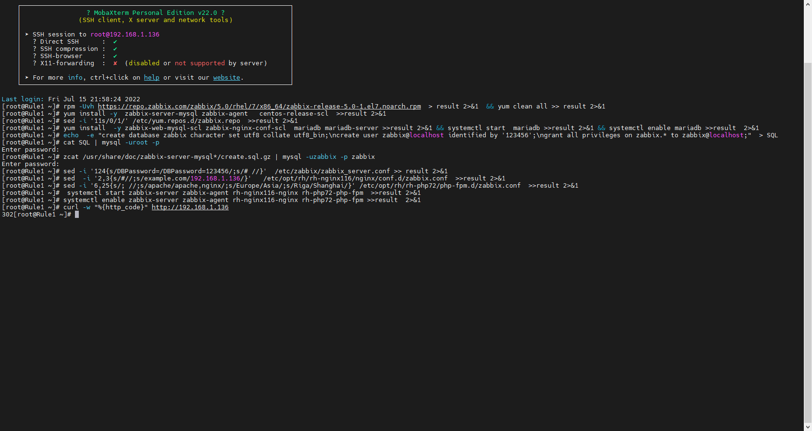

# Zabbix

## 前述

1、本章内容

【1】Zabbix安装

【2】不断补充中，相应内容会不断在相应位置填充。

## 正篇

###### Zabbix安装

1、安装前请关闭防火墙以及Selinux，此处不再讲述。

2、安装并配置Zabbix

【01】rpm -Uvh https://repo.zabbix.com/zabbix/5.0/rhel/7/x86_64/zabbix-release-5.0-1.el7.noarch.rpm  > result 2>&1  && yum clean all >> result 2>&1

【02】yum install -y  zabbix-server-mysql zabbix-agent   centos-release-scl  >>result 2>&1

【03】sed -i '11s/0/1/' /etc/yum.repos.d/zabbix.repo  >>result 2>&1

【04】yum install  -y zabbix-web-mysql-scl zabbix-nginx-conf-scl  mariadb mariadb-server >>result 2>&1 && systemctl start  mariadb >>result 2>&1 && systemctl enable mariadb >>result  2>&1

【05】echo  -e "create database zabbix character set utf8 collate utf8_bin;\ncreate user zabbix@localhost identified by '123456';\ngrant all privileges on zabbix.* to zabbix@localhost;"  > SQL

【06】cat SQL | mysql -uroot -p

【07】zcat /usr/share/doc/zabbix-server-mysql*/create.sql.gz | mysql -uzabbix -p zabbix

【08】sed -i '124{s/DBPassword=/DBPassword=123456/;s/# //'  /etc/zabbix/zabbix_server.conf >> result 2>&1

【09】sed  -i '2,3{s/#//;s/example.com/192.168.1.136/}'   /etc/opt/rh/rh-nginx116/nginx/conf.d/zabbix.conf  >>result 2>&1

【10】sed -i '6,25{s/; //;s/apache/apache,nginx/;s/Europe/Asia/;s/Riga/Shanghai/}' /etc/opt/rh/rh-php72/php-fpm.d/zabbix.conf  >>result 2>&1

【11】 systemctl start zabbix-server zabbix-agent rh-nginx116-nginx rh-php72-php-fpm  >>result 2>&1

【12】systemctl enable zabbix-server zabbix-agent rh-nginx116-nginx rh-php72-php-fpm >>result  2>&1

【13】curl -w "%{http_code}" http://192.168.1.136

3、访问Zabbix，并进行相应配置，因太过简单不再讲述。

【1】访问网址：http://server_ip

【2】默认账户：用户名：Admin 密码：zabbix

【3】进行配置：登录后可进行相应配置
