# 相关文件

1、配置文件

2、日志文件

（1）错误日志：Error Log

【1】概述：错误日志文件对MySQL的启动、运行、关闭过程进行记录。

【2】变量：

show VARIABLES like 'log_error' \G

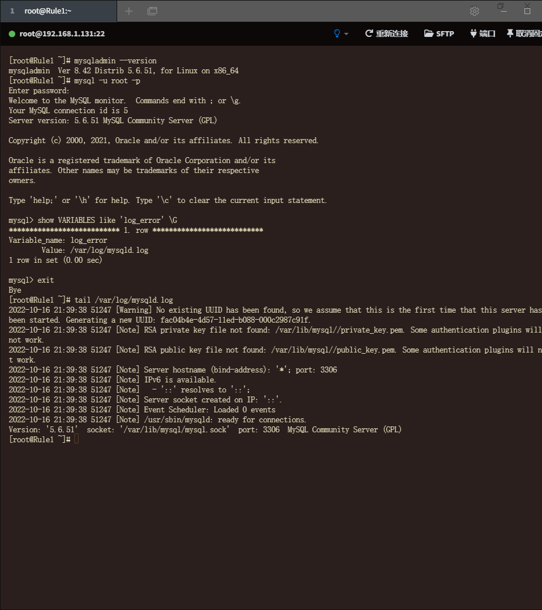

（2）查询日志：General Query Log

【1】概述：

<1>  查询日志记录了所有对MySQl的请求信息，不论这些信息是否得到了正确的执行。

<2>  日志名为：主机名.log

【2】变量：

<1>  show variables like '%general_log%';

<2>  set global general_log=ON;

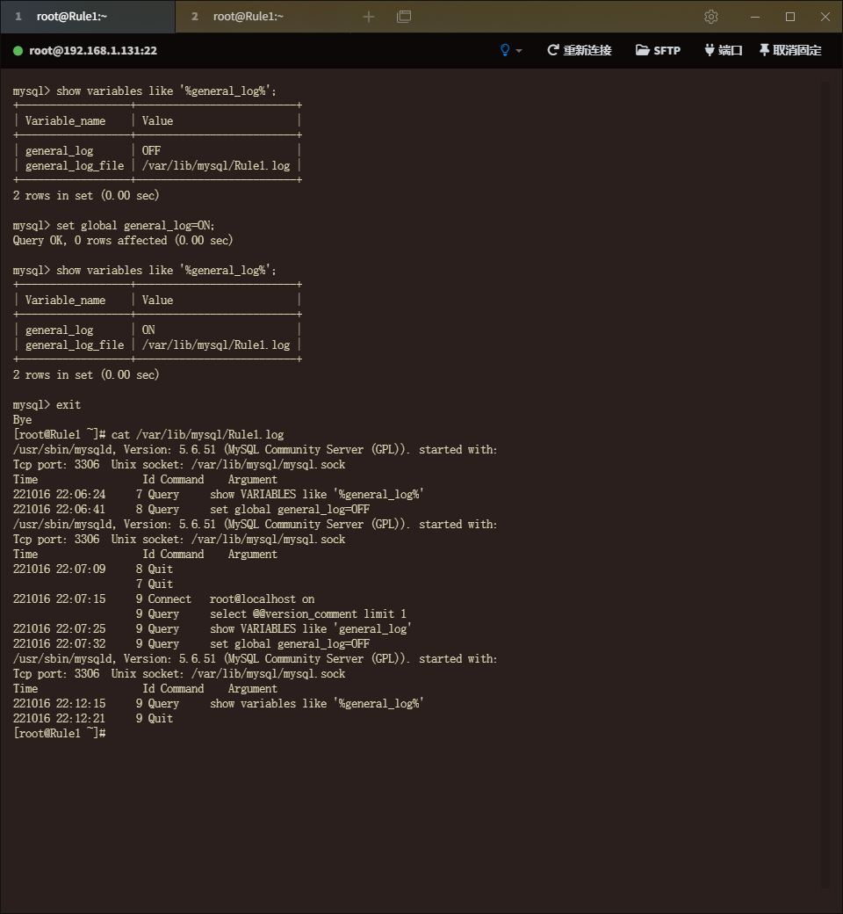

<3>  show variables like '%log_output%';

<4>  set global log_output='table';  

将此日志记录存放到general_log表中

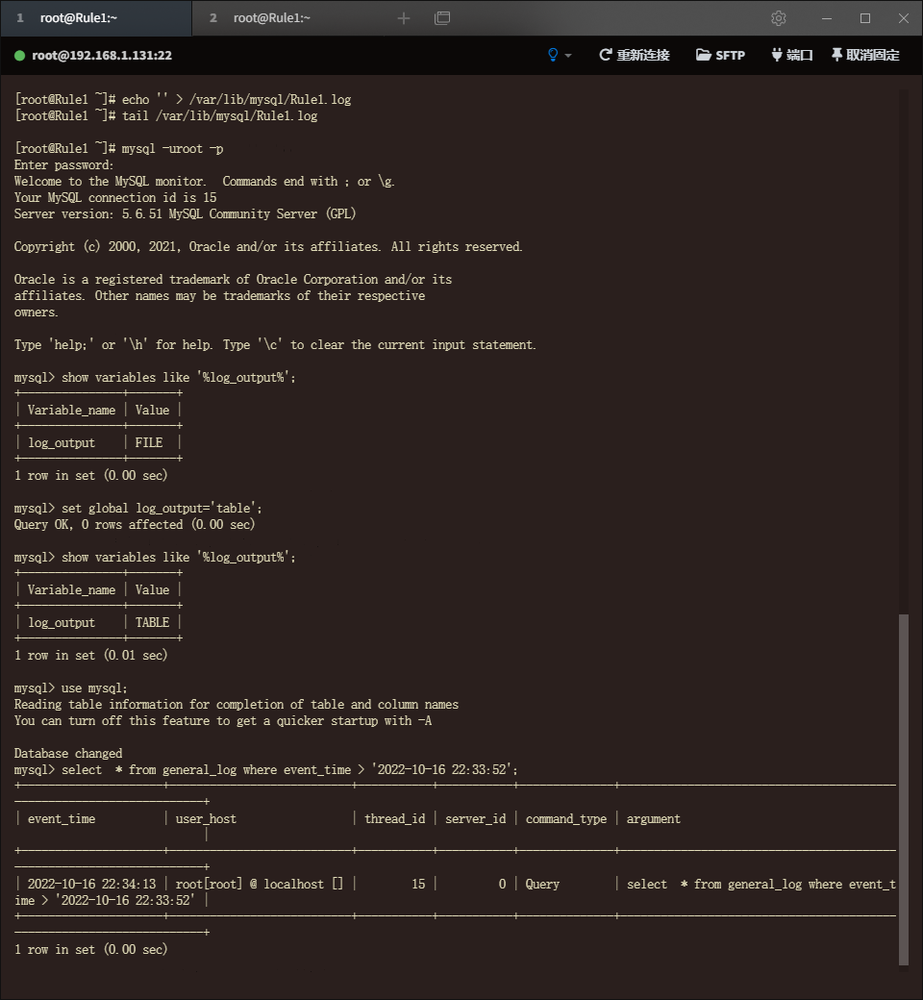

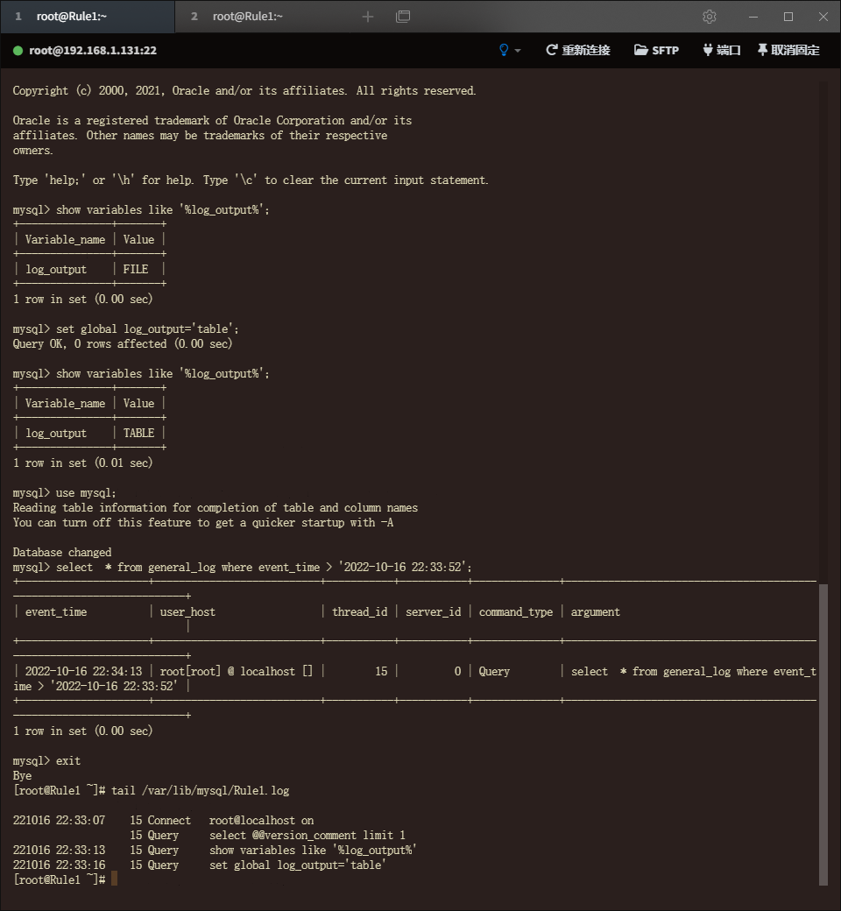

（3）慢查询日志

【1】概述：MySQL 启动时可以设置一个阈值，将运行时间超过该值的所有SQL语句都记录到慢查询日志文件中。

【2】变量：

<1>  slow_query_log：查看慢查询日志是否开启。

<2>  slow_query_log_file：查看慢查询日志的文件路径。

<4>  long_query_time：确认记录的语句运行的阈值。超过阈值才记录，等于阈值不记录。5.1开始，启动微妙记录运行时间

<2>  log_throttle_queries_not_using_indexes：允许每分钟记录到日志的未使用索引的语句的次数。

<6>   log_output：将日志记录到相应的表当中，同查询日志。记录所在表：mysql.slow_log。

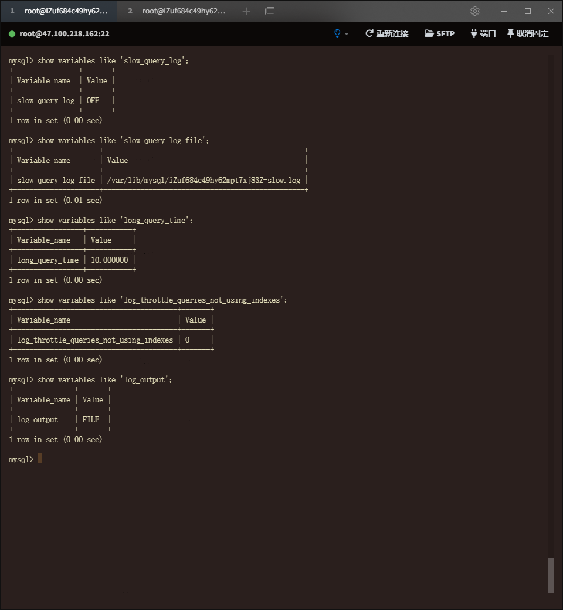

（4）二进制日志：binary log

【1】概述：

<1>  内容：The binary log contains “events” that describe database changes such as table creation operations or changes to table data. 

<2>  用途：

The binary log has two important purposes:

For replication, the binary log on a source replication server provides a record of the data changes to be sent to replica servers. The source server sends the events contained in its binary log to its replicas, which execute those events to make the same data changes that were made on the source.

Certain data recovery operations require use of the binary log. After a backup has been restored, the events in the binary log that were recorded after the backup was made are re-executed. These events bring databases up to date from the point of the backup.  

<3>   注意事项：

The binary log is not used for statements such as SELECT or SHOW that do not modify data. To log all statements (for example, to identify a problem query), use the general query log. 

【2】变量：

<01>  log_bin：是否激活二进制日志

<02>  log_bin_basename：binlog的基础命名和存储路径

<03>  max_binlog_size：单个二进制文件的最大值。如果超过该值，则产生新的二进制文件，后缀名+1，并记录到.index文件。

<04>  log_bin_index：binlog索引文件的基础命名和存储路径

<05>  sync_binlog：与磁盘同步的频率

<06>  binlog_format：二进制日志的格式

<07>  binlog_cache_size：

当使用事务的表存储引擎（如InnoDB存储引擎）时，所有未提交的二进制日志会被记录到一个缓存中，等该事务提交时直接将缓冲中的二进制日志写入二进制日志文件，而该缓冲区的大小由binlog_cache_size决定。

binlog_cache_size是基于会话（session）的：也就是说当一个线程开启一个事务时，MySQL会自动分配一个大小为binlog_cache_size的缓存

Within an uncommitted transaction, all updates (UPDATE, DELETE, or INSERT) that change transactional tables such as `InnoDB` tables are cached until a COMMIT statement is received by the server. At that point, mysqld writes the entire transaction to the binary log before the COMMIT is executed.

When a thread that handles the transaction starts, it allocates a buffer of binlog_cache_size to buffer statements. If a statement is bigger than this, the thread opens a temporary file to store the transaction. The temporary file is deleted when the thread ends.

<08>  max_binlog_cache_size：

The max_binlog_cache_size system variable (default 4GB, which is also the maximum) can be used to restrict the total size used to cache a multiple-statement transaction.

默认值：4G：The minimum value is 4096.

<09>  sql_log_bin：控制是否为当前会话启用到二进制日志的日志记录

<10>  log_slave_updates：

从库开启log-bin参数，如果直接往从库写数据，是可以记录log-bin日志的，但是从库通过I0线程读取主库二进制日志文件，然后通过SQL线程写入的数据，是不会记录binlog日志的。也就是说从库从主库上复制的数据，是不写入从库的binlog日志的。所以从库做为其他从库的主库时需要在配置文件中添加log-slave-updates参数

【3】Startup Options 

<1>  binlog-do-db：此参数表示只记录指定数据库的二进制日志

<2>   binlog-ignore-db：此参数表示不记录指定的数据库的二进制日志。

与binlog-do-db，一般只选择其一设置，只能在启动命令行中或配置文件中加入。

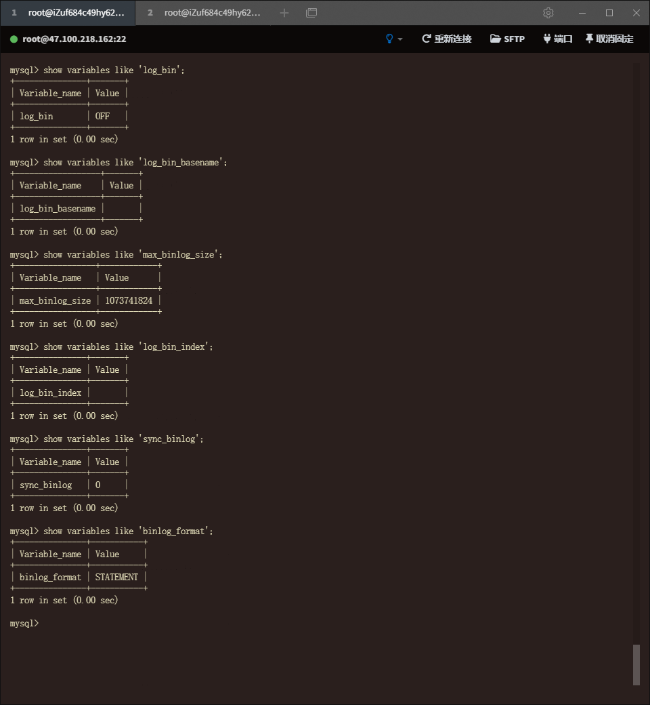

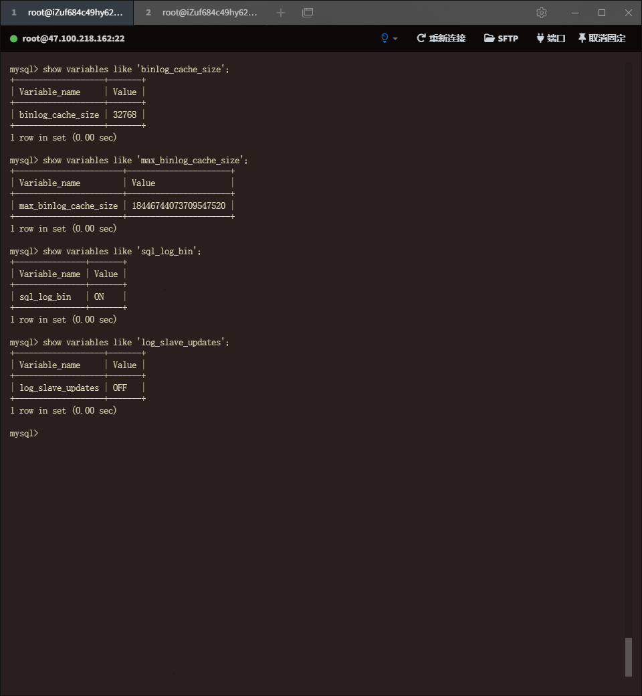

（5）其他的日志

【1】死锁日志

<1>概述：记录死锁的相关信息

<2>变量：

 show variables like 'innodb_print_all_deadlocks';

将数值设置为1，可将死锁日志输出到错误日志当中（设置为1时只会记录死锁部分信息）。

<3>死锁其他查询方式：

show engine innodb status;

此show内容后续会详细介绍

通过查看latest detected deadlock 部分可以查看最近的一次死锁。

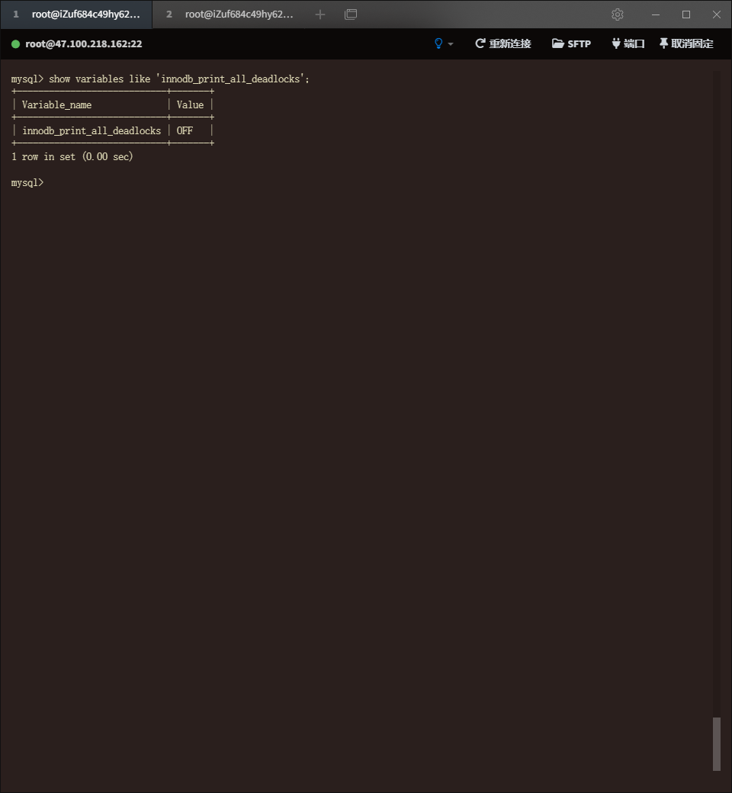

【2】中继日志：Relay log

Data changes received from a replication source server

【3】DDL日志：DDL log (metadata log)

Metadata operations performed by DDL statements

（6）其他的变量：

【1】innodb_status_output：

将Innodb监视信息输出到mysqld标准错误输出

通常情况下即将监视信息输出到错误日志当中

【2】innodb_status_output_locks：

将Innodb锁监视信息输出到mysqld标准错误输出

通常情况下即将监视信息输出到错误日志当中

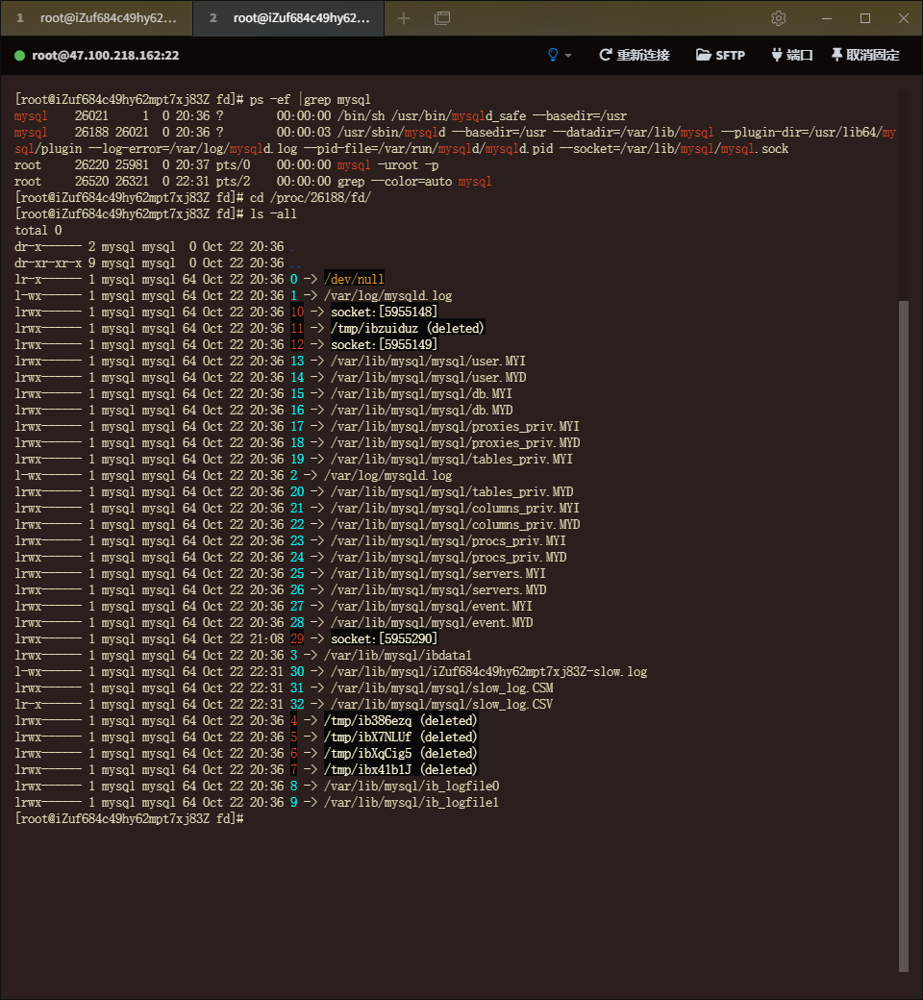

3、PID文件

（1）概述：当MySQL实例启动时，会将自己的PID写入到一个文件中，这个文件就是PID文件

（2）变量：

【1】pid_file：pid文件所在位置

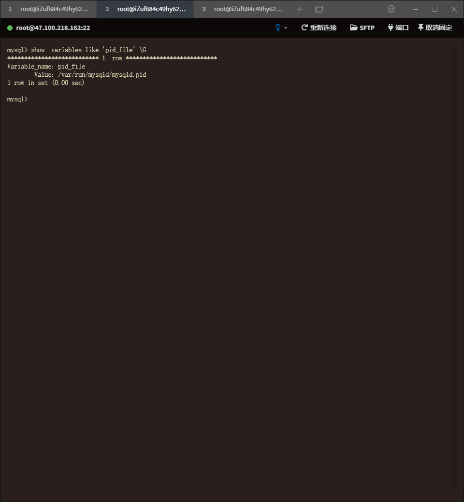

4、套接字文件

（1）概述：

【1】Linux系统下本地连接MySQL使用（可以）域套接字的方式。譬如mysql客户端工具不加-h链接。

【2】域套接字不走网络协议栈，速度更快，效率更高。

（2）变量：

【1】socket：域套接字文件所在位置

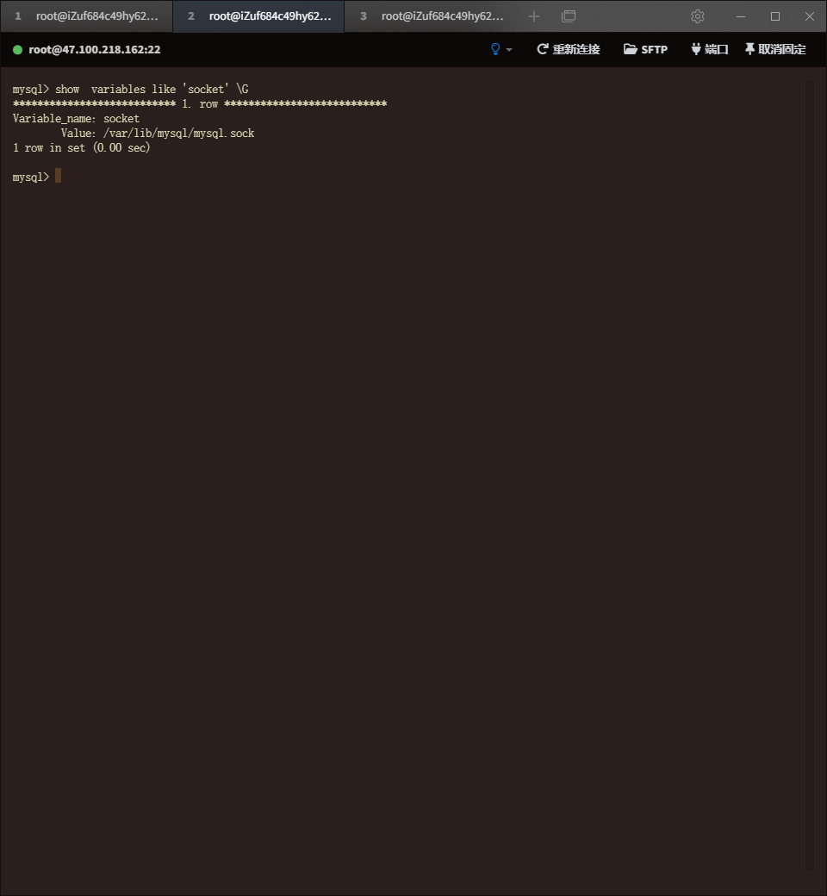

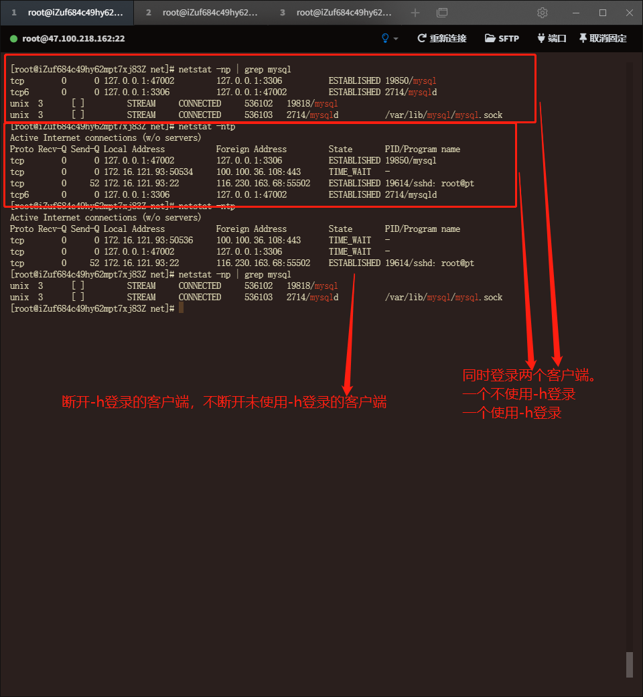

5、表结构定义文件

（1）概述：

【1】因为MySQL插件式存储引擎的体系结构的关系，MySQL数据的存储是根据表进行的，每个表都会有阈值对应的文件。

【2】不论表使用哪种存储引擎，都会有表结构定义文件（frm）记录该表的表结构定义。

【3】该文件记录了该表的表结构定义。

【4】视图文件，依旧使用表结构定义文件存储（定义）。

【5】表结构文件后缀名为：.frm。

【6】视图表结构文件为文本文件，可以直接cat查看。

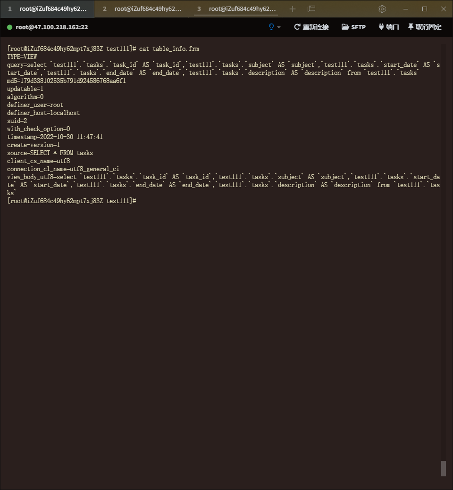

6、存储引擎相关文件（仅限InnoDB）

（1）表空间文件

【1】概述：仅做概括性介绍，后续详情在存储引擎部分会再详讲。

<1>表空间：InnoDB存储引擎逻辑结构的最高层，所有的数据都是存放在表空间中。一般分为系统表空间和独立表空间。

<2>版本相关：5.6版本以后默认会开启使用独立表空间。

<3>文件名称：

- 默认的系统表空间文件名称为：ibdata1。

- 默认的独立表空间名称为：表名.ibd

【2】类型：

  <1> 系统表空间（System Tablespace）：

 The system tablespace is the storage area for the InnoDB data dictionary, the doublewrite buffer, the change buffer, and undo logs. It may also contain table and index data if tables are created in the system tablespace rather than file-per-table tablespaces.

  The system tablespace can have one or more data files. By default, a single system tablespace data file, named ibdata1, is created in the data directory. 

  <2>  独立表空间（File-Per-Table Tablespace）：

  A file-per-table tablespace contains data and indexes for a single InnoDB table, and is stored on the file system in a single data file.

  InnoDB creates tables in file-per-table tablespaces by default. This behavior is controlled by the innodb_file_per_table variable. Disabling innodb_file_per_table causes InnoDB to create tables in the system tablespace.

【3】变量：

  <1> innodb_data_file_path：

- The size and number of system tablespace data files is defined by the innodb_data_file_path startup option.

- 配置后需要重启

  <2> innodb_file_per_table：是否开启独立表空间。

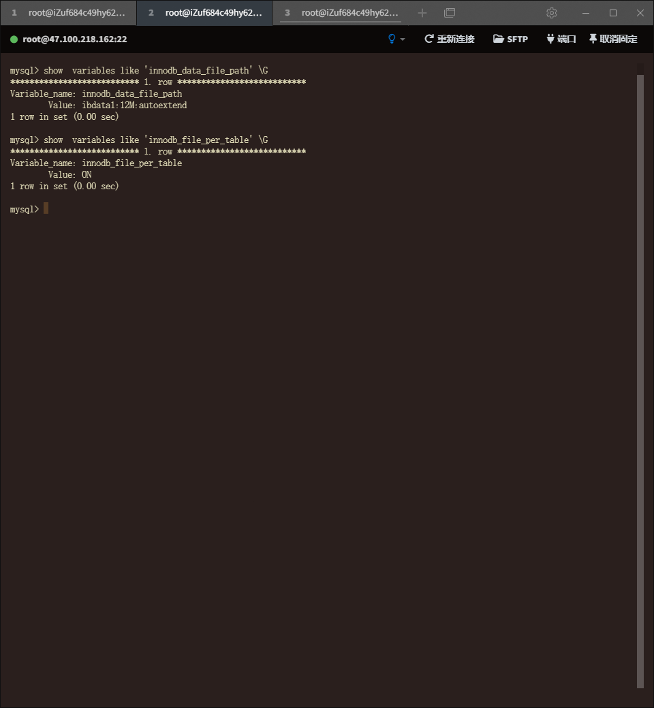

（2）重做日志文件：

【1】概述

  <1> The redo log is a disk-based data structure used during crash recovery to correct data written by incomplete transactions. 

  <2> By default, the redo log is physically represented on disk by two files named ib_logfile0 and ib_logfile1.

  <3> MySQL writes to the redo log files in a circular fashion. 

【2】变量

  <1> innodb_log_group_home_dir：

- innodb_log_group_home_dir defines directory path to the InnoDB log files.
-  If this option is not configured, InnoDB log files are created in the MySQL data directory (datadir).

  <2> innodb_log_file_size：每个重做日志文件的大小

  <3> innodb_log_files_in_group：日志文件组中重做日志文件的数量

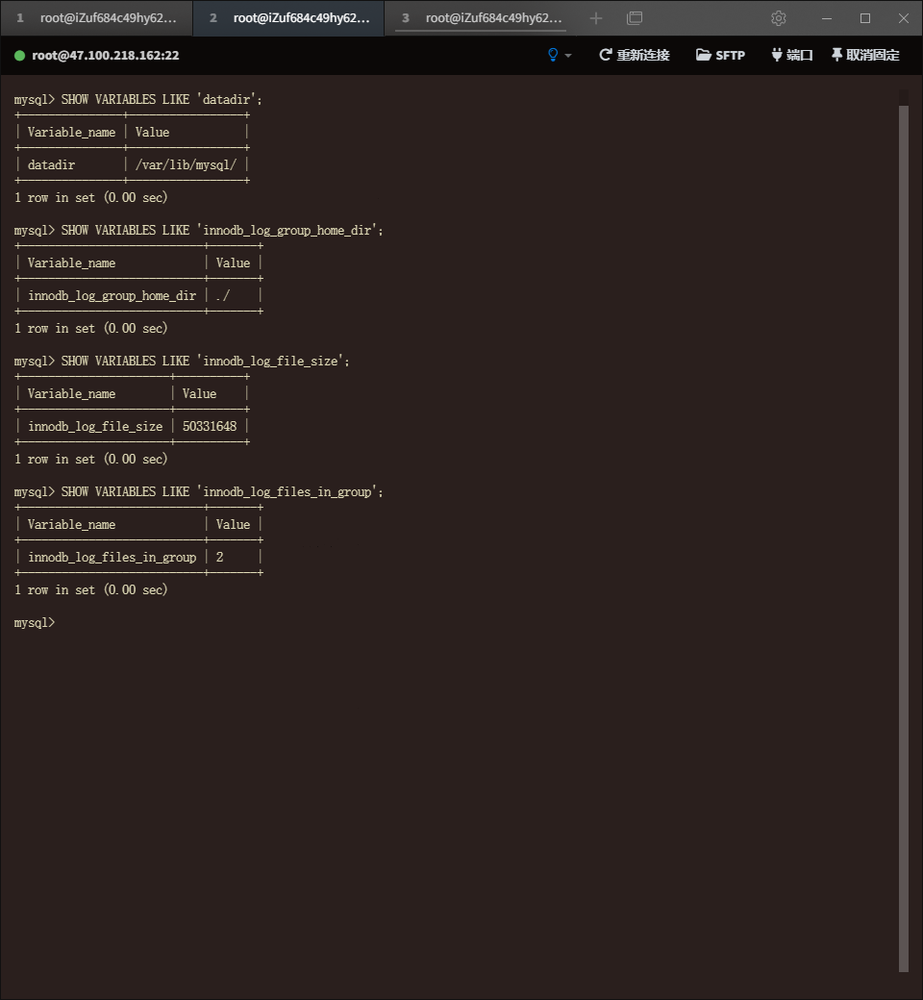

[^]: b.opt：建库过程中自动生成的，用来记录该库的默认字符集编码和字符集排序规则。如果删除将采用设character_set_server设置

